# 🧠 DIEPS: AI-Powered Intent Execution Protocol


**DIEPS (Decentralized Intent Execution Protocol System)** is a next-generation liquidity intelligence and execution layer. It allows users to express their trading desires in natural language (e.g., *"Swap 1000 SUI for USDC with the safest route"*), dynamically resolves the optimal algorithmic path across all Sui DEXs (Cetus, Turbos, etc.), passes the route through a Bayesian risk guardian, and seamlessly outputs a secure Programmable Transaction Block (PTB).

---

## 🌊 1. System Processing Flow

<p align="center">
  
</p>

The core architecture runs on a 4-step pipeline designed to securely transition abstract user intent into deterministic blockchain execution:

1.  **Intent Parsing Engine (Solver):**
    *   Users input natural language requests.
    *   The engine extracts quantitative parameters (Source Token, Destination Token, Amount) and qualitative constraints (e.g., Safest, Fastest, Max Output).
    *   *Output:* A normalized Intent Object.
2.  **Graph State Manager (In-Memory Persistence):**
    *   Maintains an ultra-low latency (`< 200ms` refresh) directed acyclic graph (DAG) of actively monitored liquidity pools across various decentralized exchanges.
    *   *Output:* Current liquidity depth, fee ratios, and token balances.
3.  **Defensive Routing Engine:**
    *   Processes the structured intent against the live graph state to construct the mathematically optimal trade route. 
    *   *Output:* Multi-hop array (e.g., `SUI -> CETUS -> USDC` with proportional splits).
4.  **Bayesian Guardian & PTB Assembler:**
    *   Evaluates the route for smart contract, liquidity, and toxic flow risks.
    *   Upon clearing the risk threshold, the engine compiles a Sui Programmable Transaction Block (MoveCalls, Split/MergeCoins) ready for wallet signature.

---

## 🧮 2. Mathematical Algorithms

### A. Routing Subgraph Algorithm

To find the maximum output route, we invert the traditional shortest-path algorithm. Edge weights $W_{i,j}$ are represented by the negative log of the expected pool exchange rate $R$, adjusting for the percentage fee $F$ and slippage factor $S(x)$ dependent on trade size $x$.

$$ W_{u,v} = -\log \left( R_{u,v} \times (1 - F_{u,v}) \times (1 - S_{u,v}(x)) \right) $$

The engine calculates paths minimizing the total $W$, which directly translates to maximizing the compound token output.

### B. Bayesian Guardian Risk Engine
The Guardian analyzes the probability of catastrophic failure (Black Swan) or malicious pool manipulation (Toxic Liquidity). We utilize a Bayesian Posterior calculation using a Beta distribution prior.

1.  **Prior Belief:** We start with a strong "Safe" prior, represented as $Beta(2, 10)$, meaning there's inherently a low base rate of failure.
2.  **Evidence Matrix ($E$):** We collect real-time data features: `Slippage_Variance`, `Concentration_Index`, and `Contract_Age`.
3.  **Posterior Update:** 

    $$
    P(Risk \mid E) = \frac{P(E \mid Risk) \times P(Risk)}{P(E)}
    $$

If the resulting posterior probability threshold crosses `0.85`, the execution is flagged as **HIGH RISK** and blocked by the PTB Assembler.

---

## 💻 3. Local Development Setup

Follow these steps to clone and run the DIEPS Engine locally.

### Prerequisites
*   **Node.js**: v18.0.0 or higher
*   **npm** or **yarn**
*   A Sui Ecosystem Wallet (Sui Wallet, Surf Wallet) installed in your browser.

### Installation

1. **Clone the repository** (or download the ZIP):
   ```bash
   git clone https://github.com/your-org/dieps-protocol.git
   cd dieps-protocol
   ```

2. **Install dependencies**:
   ```bash
   npm install
   ```

3. **Environment Setup**:
   Copy the example environment variables and fill out API RPC endpoints if necessary.
   ```bash
   cp .env.example .env
   ```
   *Edit `.env` to configure your custom `SUI_GRPC_ENDPOINT` if you do not want to use the public default RPCs.*

### Running the Application

This is a Full-Stack application containing both the React/Vite Frontend and the Express API Backend.

**Start the Development Server:**
```bash
npm run dev
```
> The development server will compile the backend on-the-fly and deploy Vite's HMR middleware. The application will be accessible at `http://localhost:3000`.

**Build for Production:**
Compile both the frontend SPA and bundle the backend TypeScript into a unified Node.js deployment.
```bash
npm run build
npm run start
```

---

## 🚀 4. Algorithm Processing & System Novelty

### The Advanced Routing Algorithm

What sets DIEPS apart from traditional DEX aggregators is our proprietary implementation of the **Routing Algorithm**. Traditional routing engines often struggle with latency when computing paths across highly fragmented liquidity states. 

Our team has specifically developed and fine-tuned this routing algorithm to achieve unprecedented practical processing speeds. This optimization is crucial for the **Intent Engine**, allowing it to instantly interpret user desires and compute the most optimal path in real-time.

### Why this matters for the Ecosystem:
- **Ultra-Fast Execution:** By drastically reducing the graph traversal time, the Routing algorithm ensures that users get the best possible rates before market conditions change.
- **Empowering New Users:** The blazing-fast intent resolution abstracts away the complexities of decentralized finance. New users don't need to manually compare DEXs or understand slippage intricacies; the engine handles it optimally and instantly.
- **Attracting Liquidity and Volume:** Providing a seamless, zero-latency execution experience is key to onboarding the next wave of users into the Sui ecosystem, ultimately driving higher volume and liquidity utilization across all integrated protocols.

## 🔒 Security Notice
*This is an experimental interface running on Testnet endpoints by default. Real PTB submission and Move execution features simulate their states unless connected to mainnet RPC nodes.*
